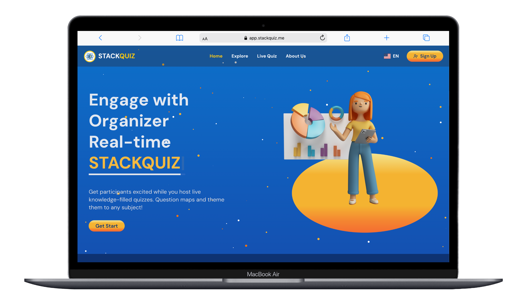
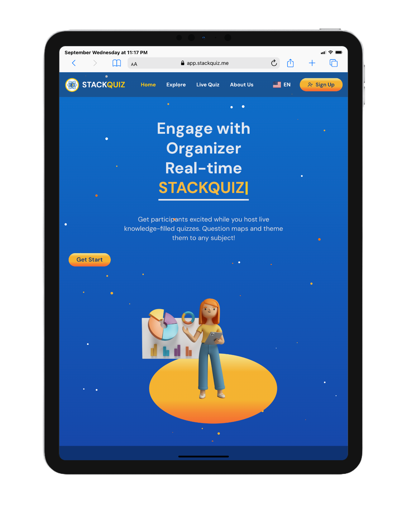
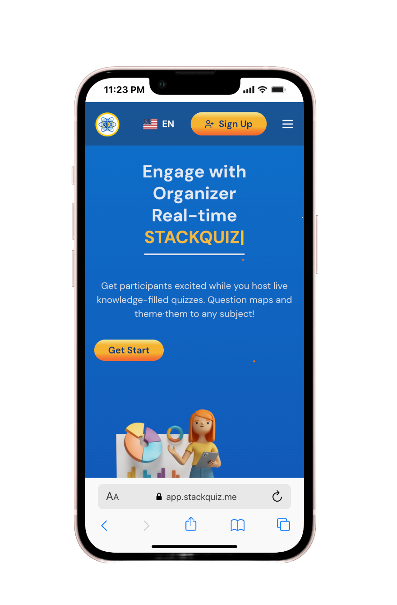

# 🎯 Welcome to STACKQUIZ

`STACKQUIZ` is an online learning and assessment platform designed to provide students with a seamless and interactive way to take quizzes, while giving instructors and admins the tools to manage, edit, and evaluate quizzes efficiently. Our platform ensures a smooth experience for learners, organizers, and administrators with an intuitive interface, secure authentication, and robust features.

We focus on **reliability, simplicity, and flexibility** so you can focus on learning, teaching, and managing without distractions.

## 📢 STACKQUIZ Logo
<p align="center">
  
</p>

---

## 📱 Platform Preview
<p align="center">
  
  
  
</p>

---

## ✨ Key Features

**StackQuiz empowers users with 3 main operational modes:**

### 👨‍🏫 Organizer Mode (Authenticated Users)
- 📝 **Create & Manage Quizzes** – Multiple formats: MCQ, True/False, polls, fill-in-the-blank, and text input, with timers, points, and difficulty levels
- ✏️ **Edit, Duplicate, Delete Quizzes** – Full control over your content
- 🎮 **Host Live Sessions** – Generate room codes, control pace, skip or pause questions
- 📊 **Analytics Dashboard** – See participant scores, most-missed questions, and overall performance
- 🤝 **Collaboration Tools** – Invite co-organizers, manage shared quiz libraries, and run team competitions
- 🌐 **Publish to Explore** – Share quizzes publicly for others to discover
- 🔗 **Multi-Access Options** – Unique room codes, links, and QR codes provided for every session
- ⚙️ **Flexible Settings** – Randomize questions, enable team mode, control scoring rules

### 👥 Guest Mode (Participants without Login)
- 🚀 **Instant Access** – Join quizzes instantly with a room code, no account required
- 🎭 **Smart Nickname System** – Pick your own display name or use our random generator with inappropriate-name filtering
- ⏱️ **Real-Time Engagement** – See questions in real time with countdown timers and progress bars
- 🏆 **Live Feedback & Rankings** – Get instant answer feedback, view leaderboards, and track your final score
- 🔄 **Second Chances** – In case of ties, players can retry missed or incorrect questions

### 🔐 Admin Mode (Full Platform Control)
- 🌍 **System-Wide Management** – Access all data, settings, and configurations
- 👤 **User Administration** – View, edit, ban, suspend, or reset passwords for any account
- 🛡️ **Content Moderation** – Approve, delete, or flag quizzes; maintain moderation logs
- 📈 **Comprehensive Analytics** – Track active users, quiz stats, top organizers, and engagement trends
- 🎧 **Support Management** – Respond to reports and escalate issues if needed
- ✅ **Quality Control** – Approve only high-quality content for public Explore section

---

## 🚀 Live Platform

Access our production-ready platform:

**🌐 [STACKQUIZ Live Platform](https://app.stackquiz.me/)**

---

## ⚙️ Getting Started

### 📥 Installation

**Clone the repository:**
```bash
git clone https://github.com/FSWD-GEN-01/stack-quiz-frontend.git
cd stack-quiz-frontend
```

**Install dependencies:**
```bash
npm install
```

**Run the development server:**
```bash
npm run dev
```

---

## 🛠 Technology Stack

STACKQUIZ leverages cutting-edge technologies for optimal performance, security, and user experience.

### 🎨 Frontend Technologies

#### **🏗️ Core Framework & Libraries**
- **⚡ Next.js (App Router)** - React-based full-stack framework with SSR, SSG, and performance optimization
- **⚛️ React.js** - Component-based JavaScript library for interactive user interfaces
- **📘 TypeScript** - Strongly typed JavaScript for enhanced reliability and developer experience

#### **🎭 Styling & UI Components**
- **🌊 Tailwind CSS** - Utility-first CSS framework for rapid, responsive design
- **🎨 CSS3** - Modern styling with animations, transitions, and responsive layouts
- **📄 HTML5** - Semantic markup for accessibility and SEO optimization
- **🧩 Shadcn/ui Components** - Modern, accessible, and customizable component library

#### **🔄 State Management & Logic**
- **🗃️ Redux** - Predictable state container for complex application state management
- **🚀 JavaScript (ES6+)** - Modern JavaScript features for enhanced functionality

### ⚙️ Backend Technologies

#### **🏢 Core Framework**
- **☕ Spring Boot** - Enterprise-grade Java framework for scalable web applications and REST APIs
- **🔐 Keycloak** - Open-source identity and access management for secure authentication
- **🔌 WebSocket** - Real-time bidirectional communication for live quiz sessions

### 💾 Database & Caching

#### **🗄️ Primary Database**
- **🐘 PostgreSQL** - Advanced relational database with ACID compliance and high performance

#### **⚡ Caching Layer**
- **🔴 Redis** - In-memory data store for:
  - 💾 Session management
  - 🏃‍♂️ Real-time quiz data caching
  - 🏆 Leaderboard storage
  - 🔗 WebSocket connection management

### 🐳 DevOps & Deployment

#### **📦 Containerization**
- **🐋 Docker** - Containerization for:
  - 📦 Application packaging and deployment
  - 🔄 Environment consistency
  - 🏗️ Microservices orchestration
  - 📈 Simplified scaling

#### **🌐 Web Server & Infrastructure**
- **🚀 NGINX** - High-performance reverse proxy for load balancing and SSL termination
- **☁️ Cloud Deployment** - Scalable cloud infrastructure
- **🔄 CI/CD Pipeline** - Automated testing, building, and deployment

---

## 🗺️ Navigation Structure

### 🌐 Public Pages

• 🏠 **Home Page:** Platform overview and introduction  
• 🔍 **Explore:** [https://app.stackquiz.me/explore](https://app.stackquiz.me/explore) - Discover public quizzes  
• 🎮 **Live Quiz:** [https://app.stackquiz.me/join-room](https://app.stackquiz.me/join-room) - Join active quiz sessions  
• ℹ️ **About Us:** [https://app.stackquiz.me/about](https://app.stackquiz.me/about) - Learn about our mission  
• 🔑 **Login:** [https://app.stackquiz.me/login](https://app.stackquiz.me/login) - User authentication  
• 📝 **Register:** [https://app.stackquiz.me/signup](https://app.stackquiz.me/signup) - Create new account  

### 🔐 Authenticated User Pages


  ○ 📊 **Main Dashboard:** [https://app.stackquiz.me/dashboard](https://app.stackquiz.me/dashboard) - Overview and quick actions  
  ○ ⚙️ **Profile Settings:** Update user information and configure preferences  

### 🛡️ Admin Panel Structure

• 🔐 **Admin Dashboard:** System-wide management and analytics  
  ○ 👥 **User Management:** [https://app.stackquiz.me/admin/users](https://app.stackquiz.me/admin/users) - Manage user accounts  
  ○ 🛡️ **Content Moderation:** [https://app.stackquiz.me/admin/content](https://app.stackquiz.me/admin/content) - Quiz approval and moderation  
  ○ 📊 **System Analytics:** [https://app.stackquiz.me/admin/analytics](https://app.stackquiz.me/admin/analytics) - Platform performance metrics  

• 🛠️ **System Configuration:**  
  ○ ⚙️ **Platform Settings:** [https://app.stackquiz.me/admin/settings](https://app.stackquiz.me/admin/settings) - System preferences  
  ○ 🔒 **Security Management:** [https://app.stackquiz.me/admin/security](https://app.stackquiz.me/admin/security) - Security monitoring  

### 📝 Quiz Management

• 👨‍🏫 **Organizer Tools:** Create and manage quiz content  
  ○ 📚 **My Quizzes:** [https://app.stackquiz.me/organizer/quizzes](https://app.stackquiz.me/organizer/quizzes) - Quiz library management  
  ○ ➕ **Create Quiz:** [https://app.stackquiz.me/organizer/create](https://app.stackquiz.me/organizer/create) - Build new quizzes  
  ○ 🎮 **Live Sessions:** [https://app.stackquiz.me/organizer/sessions](https://app.stackquiz.me/organizer/sessions) - Host active sessions  
  ○ 📈 **Quiz Analytics:** [https://app.stackquiz.me/organizer/analytics](https://app.stackquiz.me/organizer/analytics) - Performance insights  

• 🎯 **Player Experience:**  
  ○ 🚪 **Join Quiz:** [https://app.stackquiz.me/play/join](https://app.stackquiz.me/play/join) - Enter room codes  
  ○ 🌐 **Browse Quizzes:** [https://app.stackquiz.me/explore](https://app.stackquiz.me/explore) - Discover public content  
  ○ 🏆 **My Results:** [https://app.stackquiz.me/play/results](https://app.stackquiz.me/play/results) - Performance history  

---


## 🙏 Acknowledgments

We extend our heartfelt gratitude to our mentors:

**👩‍🏫 Ms. Srorng Sokcheat** and **👨‍🏫 Mr. Sreng Chipor**

Their invaluable guidance, patience, and unwavering support have been instrumental in developing **StackQuiz**. This project would not have been possible without their dedication and belief in our abilities.

**🌟 Thank you for inspiring us to grow as developers!**

---

## 💡 Our Mission

### 😍 **"Stack Up Your Knowledge with STACKQUIZ"**

*Empowering education through innovative, interactive, and accessible quiz experiences.*

---

<p align="center">
  <strong>🚀 Ready to transform your learning experience?</strong><br/>
  <a href="https://app.stackquiz.me/">🌐 Visit STACKQUIZ Today!</a>
</p>